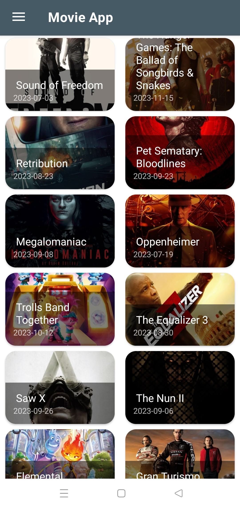
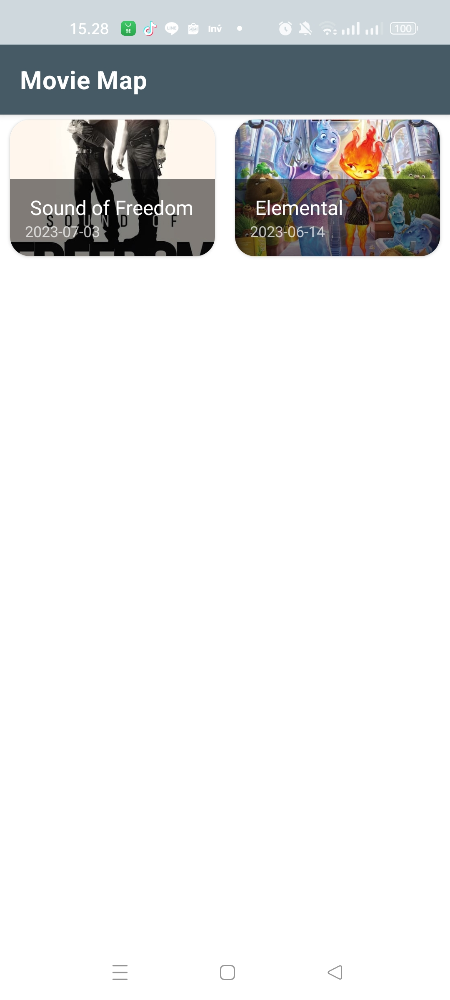

# Movie App

An Android App that shows list of movies from themoviedb api. Focusing on clean architecture and modularization with better security.

## Features

- Home
- Favorite
- Movie Detail

## Screenshots

   

## Tech Stack

- **Kotlin**
- **Android Studio**

## Authors

- [@Michael-Owen-19](https://www.github.com/Michael-Owen-19)

## Feedback

If you have any feedback, please reach out to us at owen190401@gmail.com
